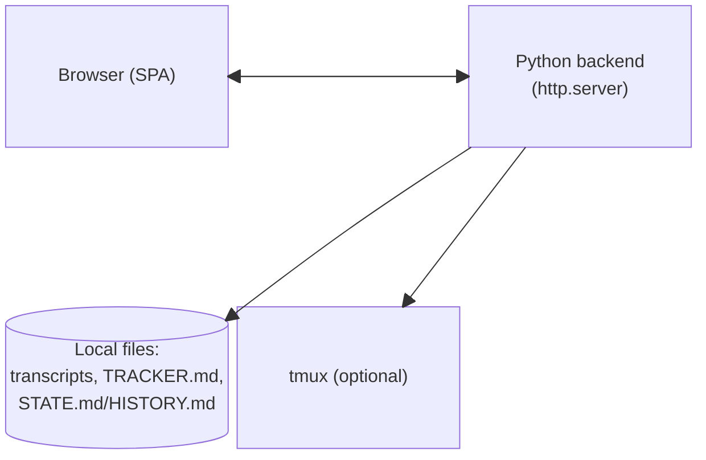
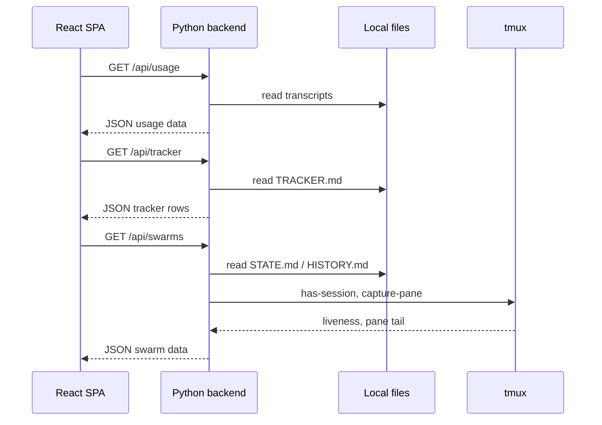
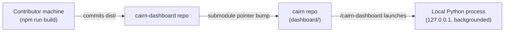

# Architecture Specification: cairn-dashboard

## Metadata
- Architecture Specification Version: v0.2
- Last Updated: 2026-08-19
- Derived From: docs/requirements/prd.md, docs/requirements/user-flows.md
- Author:
  - AI Tool: Claude Code
  - LLM Model: claude-sonnet-5
- Reviewed By:

---

## System Overview
cairn-dashboard is a local, single-user web application with two parts: a stdlib-only Python backend (living in the parent `cairn` repo at `scripts/usage_dashboard.py`) that parses local files (session transcripts, task-tracker state) and serves them as JSON, and a React single-page app (this repo, built with Vite) that polls those JSON endpoints and renders three tabs — Usage, Tracker, Swarms. There is no database, no auth, and no network exposure beyond `127.0.0.1`. The frontend is *designed* to ship as a pre-built static bundle, so the only runtime requirement for an end user will be `python3` — this is the target state this spec describes, not the current state of this repository.

**Current vs. target:** as of this spec's writing, the `cairn-dashboard` repo contains no source yet (no `package.json`, `vite.config`, `src/`, or `dist/`), and the parent repo's `scripts/usage_dashboard.py` serves an inline-HTML page with only `/api/usage` and `/api/tracker` — no `/api/swarms`, no static-file serving. Every diagram and table below describes the target architecture this spec exists to build toward, not what's running today. Elements not yet built are marked **(target)** where they first appear.

---

## Architecture Diagram

**Figure 1: System context — browser, backend, local files, and tmux**

| ID | Component | Responsibility | Technology |
|----|-----------|---------------|------------|
| C-01 | Python backend | Parses transcripts/`TRACKER.md`/`STATE.md`, serves JSON APIs and the static frontend bundle **(target — serves inline HTML today)** | Python 3 stdlib (`http.server`) |
| C-02 | React SPA | Renders Usage/Tracker/Swarms tabs, polls the backend every 4s **(target — not yet built)** | Vite + React (TypeScript), static build |
| C-03 | tmux (external) | Queried read-only for swarm liveness and pane-tail context **(target)** | `tmux` binary, optional |

---

## Component Interactions

**Figure 2: Poll cycle — SPA requests, backend reads local state (target state — `/api/swarms` doesn't exist yet, `/api/usage`/`/api/tracker` exist today)**

| From | To | Protocol | Description |
|------|----|----------|-------------|
| React SPA | Python backend | HTTP GET, JSON response | Polled every 4s for usage/tracker/swarms |
| Python backend | Local files | Filesystem read | Transcripts, `TRACKER.md`, `STATE.md`/`HISTORY.md` — read-only, no writes |
| Python backend | tmux | Subprocess (`has-session`, `capture-pane`) | Read-only liveness/pane-tail checks, degrades to "unknown" if `tmux` is absent |

---

## Data Stores

| ID | Store | Type | Purpose | Component Owner |
|----|-------|------|---------|-----------------|
| DS-01 | `~/.claude/projects/*.jsonl` | Flat file (JSONL) | Session transcripts — token usage, tool calls | Python backend (read-only) |
| DS-02 | `docs/.tasks/TRACKER.md` | Flat file (Markdown table) | Task tracker rows (Status, Milestone) | Python backend (read-only) |
| DS-03 | `docs/.tasks/*/STATE.md`, `HISTORY.md` | Flat file (Markdown) | Per-task chain state, phase history | Python backend (read-only) |
| DS-04 | `.cairn/version-log.jsonl` | Flat file (JSONL) | Per-session cairn version | Python backend (read-only) |

No database of any kind. Every request re-parses the relevant files fresh — no caching layer, no persistence written by the dashboard itself.

---

## External Integrations

| ID | Integration | Direction | Purpose | Auth Method |
|----|-------------|-----------|---------|-------------|
| EXT-01 | `tmux` (local binary) | Outbound (subprocess) | Swarm liveness/pane-tail checks | None — local process invocation, degrades gracefully if absent |

No cloud services, third-party APIs, or auth providers. Vite/React build tooling is a dev-time dependency only, never a runtime integration for end users.

---

## Non-Functional Requirements

| ID | Category | Requirement | Design Decision | Traces to |
|----|----------|-------------|-----------------|-----------|
| NFR-001 | Dependencies | Zero new runtime dependencies for end users | Backend stays stdlib Python; frontend ships pre-built/committed — no Node/npm/FastAPI needed to run the dashboard | `prd.md` NFR-001 |
| NFR-002 | Security | Local-only, no auth | Server binds to `127.0.0.1` only; no login, no session/token handling | `prd.md` NFR-002 |
| NFR-003 | Reliability | Graceful degradation | Missing `tmux`, missing `dashboard/dist/`, empty `TRACKER.md`, zero swarms — each renders a clear state, never a crash | `prd.md` NFR-003 |

---

## Deployment Model

Single long-running local process per project, launched by `/cairn-dashboard` and backgrounded via a PID lockfile (`.cairn/usage-dashboard.pid`) — this part is already true today. No containers, no cloud deployment, no CI/CD pipeline for running it — it runs entirely on the developer's own machine, one process per project directory. **(target)** The frontend's own build (`npm run build` inside `dashboard/`) will happen at development time only, on the machine of whoever is changing the dashboard's UI — its output (`dist/`) will be committed to this repo so no build step is needed at launch time. None of this exists yet — see Current vs. target in System Overview.

**Figure 3: Build-to-run path — no build step at launch time (target state)**

---

## Security Considerations
- No authentication or authorization — access is implicit via being on the same machine (localhost binding).
- No data leaves the local machine; nothing is sent over the network beyond `127.0.0.1`.
- No secrets are read, stored, or displayed — env-var checks elsewhere in cairn (`.harness/environment.md`) are presence-only and out of this dashboard's scope entirely.

---

## Technical Risks

| Risk | Likelihood | Impact | Mitigation |
|------|-----------|--------|------------|
| Committed `dist/` drifts from source if a contributor forgets to rebuild before committing | Medium | Medium — stale UI shipped silently | No CI check yet (open question); document the build-then-commit step clearly in `dashboard/README.md` |
| Submodule-pointer bump in the parent repo is a manual step, easy to forget | Medium | Low — parent repo just stays on an older dashboard version until bumped | Deferred; candidate for `release-manager` integration later |
| `tmux` subprocess calls on every 4s poll could add overhead with many concurrent swarms | Low | Low, unverified at scale | Not optimized for in this version; revisit if real usage shows it |

---

## Assumptions & Open Questions
**Assumptions:**
- Single user, single machine — no concurrent multi-client access patterns to design for.
- The existing Python API surface (`/api/usage`, `/api/tracker`, `--task-report`, `--window-report`) is stable and not being redesigned by this effort, only extended (`/api/swarms`) and rehomed for static-file serving.

**Open Questions:**
- How does a future cairn release bump the `dashboard/` submodule pointer? (carried from PRD)
- Should `dashboard/`'s own CI verify `dist/` is in sync with source before merge? (carried from Technical Risks above)
