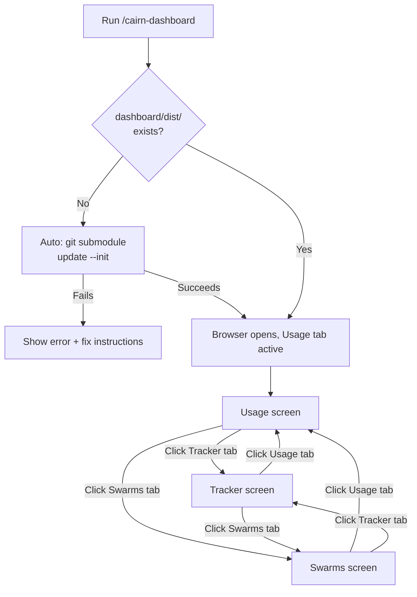
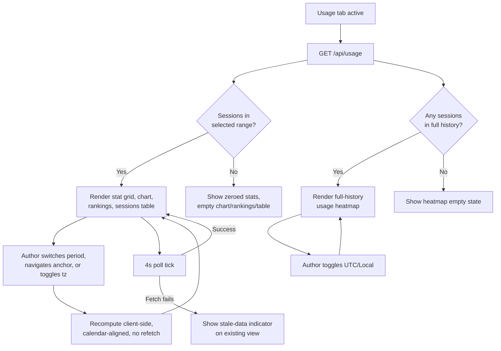
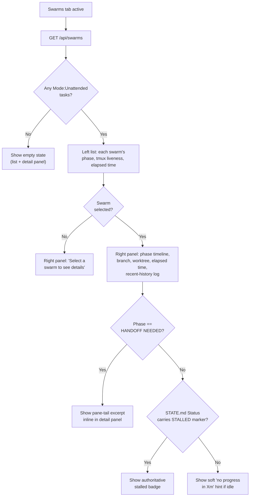

# UX Specification: cairn-dashboard

## Metadata
- UX Specification Version: v0.12
- Last Updated: 2026-08-19
- Derived From: docs/requirements/prd.md, docs/requirements/user-flows.md
- Author:
  - AI Tool: Claude Code
  - LLM Model: claude-sonnet-5
- Reviewed By:

---

## User Personas
| Persona | Description | Primary Goal |
|---------|-------------|--------------|
| Cairn author | Single user, running cairn against their own projects | Quickly check usage/cost, task state, and running swarms without digging through raw files |

---

## User Journey
The cairn author launches the dashboard via `/cairn-dashboard`, lands on the Usage screen, and moves between three always-visible tabs — Usage, Tracker, Swarms — as their attention shifts between "what am I spending," "what's in progress," and "is my background swarm stuck." Each screen polls its own data every 4 seconds; the author never manually refreshes. The whole session is read-only observation — no screen lets the author edit, delete, or trigger anything; the dashboard is a window onto state that other cairn agents/commands change, not a control surface.

---

## Interaction Flows

**Figure 1: Launch and top-level navigation**

**Figure 2: Usage screen data flow**

**Figure 3: Swarms screen decision flow (list + detail)**

---

## Navigation Model
| From Screen | Action | Destination | Condition |
|-------------|--------|-------------|-----------|
| Any screen | Click "Usage" tab | Usage screen | Always available |
| Any screen | Click "Tracker" tab | Tracker screen | Always available |
| Any screen | Click "Swarms" tab | Swarms screen | Always available |
| Tracker screen | Click "Board" sub-tab | Tracker screen, Board view | Always available |
| Tracker screen | Click "Roadmap" sub-tab | Tracker screen, Roadmap view | Always available |
| Usage screen | Click a date-range button | Usage screen, recomputed | Always available |
| Swarms screen | Click a swarm in the left list | Swarms screen, detail panel opens/swaps on the right | Always available |
| Swarms screen | Click the detail panel's close control | Swarms screen, detail panel returns to empty state | Only when a swarm is selected |
| Swarms screen | Click a sort-order button | Swarms screen, list reorders | Always available |

Direct navigation via URL hash (`#usage`, `#tracker`, `#tracker/road`, `#swarms`) lands on the same screen/sub-view without going through the tab bar — supports refresh and shared links.

---

## Screen Specifications

### Usage
**Purpose:** Let the author see Claude Code token usage and cost at a glance (US-001).
**Accessible Roles:** Cairn author (sole persona) — always accessible, no gating.

**Primary Actions:**
| Action | Available To | System Response |
|--------|-------------|-----------------|
| Select a period type (Daily / Weekly / Monthly / Yearly / YTD) | Cairn author | Stats, chart, and rankings recompute client-side against the already-fetched session list, calendar-aligned to the current anchor — no refetch (FR-007) |
| Click prev/next | Cairn author | Anchor shifts by one period unit (day/week/month/year); view recomputes. Disabled past the earliest recorded session (prev) or past today (next). Not shown for YTD (no anchor). |
| Click "Latest" | Cairn author | Anchor jumps back to today |
| Toggle UTC/Local | Cairn author | Bucket boundaries (hour/day/month) and every displayed timestamp shift accordingly, independent of the period/anchor selection |
| Hover/focus the filter info icon | Cairn author | Tooltip explains the period types, anchor navigation, and the UTC/Local toggle |
| Hover a heatmap cell | Cairn author | Tooltip shows that day's date, tokens, and cost — heatmap itself always shows full session history, independent of the period/anchor filter |
| Click a sessions-table column header | Cairn author | Table sorts by that column ascending; clicking the same header again reverses to descending |
| Pick a Model or Version filter above the sessions table | Cairn author | Table narrows to matching rows within the current window, no refetch; picking "All" clears that filter |
| Click sessions-table Prev/Next | Cairn author | Table pages through the current (possibly filtered) row set |
| (passive) Wait for the 4s poll | Cairn author | View updates in place with new usage data, no visible reload |

**Permission Rules:**
| Element / Action | Role | Visibility |
|-----------------|------|------------|
| Entire screen | Cairn author | Always visible |
| Prev/next navigation | Cairn author | Hidden for YTD; disabled at the earliest-session/today boundary otherwise |
| Usage heatmap | Cairn author | Always visible once any session exists; empty-state message when there is no session history at all |
| Sessions-table pagination | Cairn author | Shown only when the current (filtered) row set exceeds one page |

**States:**
- **Loading:** "Loading…" text shown only on the very first fetch, before any data has ever rendered.
- **Empty:** No sessions in the selected window — stat grid shows zeroed values, chart/rankings/sessions table each show their own empty-state message, never an error. No sessions in full history at all — heatmap shows its own empty-state message instead of a blank/empty-cell grid. A model/version filter matching zero sessions in the window shows the sessions table's own empty state, not a blank body.
- **Error:** A poll fails after data has already rendered once — a stale-data indicator appears on the existing (last-good) view; the screen never clears to blank or crashes.
- **Success:** The rendered stat grid/chart/rankings/table *is* the success state — no separate confirmation affordance needed.

---

### Tracker
**Purpose:** Let the author see task-tracker state (Board and Roadmap) without opening `TRACKER.md` directly (US-002).
**Accessible Roles:** Cairn author (sole persona) — always accessible, no gating.

**Primary Actions:**
| Action | Available To | System Response |
|--------|-------------|-----------------|
| Switch between Board and Roadmap sub-tabs | Cairn author | Same already-fetched row data re-rendered grouped by Status (Board) or Milestone (Roadmap) |
| (passive) Wait for the 4s poll | Cairn author | Rows update in place if `TRACKER.md` changed |

**Permission Rules:**
| Element / Action | Role | Visibility |
|-----------------|------|------------|
| Entire screen | Cairn author | Always visible |

**States:**
- **Loading:** "Loading…" text shown only on the very first fetch.
- **Empty:** `TRACKER.md` doesn't exist or has no rows — a single empty-state message replaces both sub-views (Board/Roadmap sub-tabs hide until rows exist).
- **Error:** A poll fails after data has already rendered once — stale-data indicator, same as Usage.
- **Success:** The rendered Board/Roadmap itself is the success state.

---

### Swarms
**Purpose:** Let the author monitor running Unattended coding-chain swarms — full status without manually checking `tmux`/`STATE.md`, and without leaving the screen (US-003).
**Accessible Roles:** Cairn author (sole persona) — always accessible, no gating.
**Layout note:** Screen toolbar (sort order) + list + detail split (left: swarm list, right: detail panel) — see UI Layout Specification for structure.

**Primary Actions:**
| Action | Available To | System Response |
|--------|-------------|-----------------|
| Click a swarm in the left list | Cairn author | Selects it; right panel opens (or swaps) to show its phase timeline, branch, worktree, elapsed time, and recent-history log |
| Click the close control on the detail panel | Cairn author | Deselects the current swarm; right panel returns to the empty-state prompt |
| Select a sort order (Priority / Recent activity / Name) | Cairn author | List reorders client-side, no refetch — selection persists across polls |
| Hover/focus the sort toolbar's info icon | Cairn author | Tooltip explains what each of the 3 sort modes means |
| (passive) Wait for the 4s poll | Cairn author | List and (if selected) detail panel update in place — phase, liveness, badges, history recompute from fresh `STATE.md`/`HISTORY.md` reads; current sort order re-applied |

**Permission Rules:**
| Element / Action | Role | Visibility |
|-----------------|------|------------|
| Entire screen | Cairn author | Always visible |
| Detail panel content | Cairn author | Only rendered once a swarm is selected; empty-state prompt otherwise |
| Pane-tail excerpt (in detail panel) | Cairn author | Only for the selected swarm when its `phase == HANDOFF NEEDED` |
| Authoritative stalled badge | Cairn author | Only for swarms whose `STATE.md` `Status` already carries the `STALLED (...)` marker |
| Soft "no progress" hint | Cairn author | Only for swarms that are idle but not `STALLED`, `HANDOFF NEEDED`, or `PUBLISH` |

**States:**
- **Loading:** "Loading…" text shown only on the very first fetch.
- **Empty (no swarms):** No `Mode: Unattended` tasks exist — "No unattended swarms running." message spans the list; detail panel shows nothing to select.
- **Empty (no selection):** Swarms exist but none is selected — right panel shows "Select a swarm to see details."
- **Error:** A poll fails after data has already rendered once — stale-data indicator, same as Usage/Tracker.
- **Success:** The rendered list (and, once selected, detail panel) is the success state.

---

## Assumptions & Open Questions
**Assumptions:**
- Single persona, no auth, no role gating — every action and screen is visible to whoever opens the dashboard, consistent with Project Definition's local-only scope.
- The dashboard is read-only observation throughout — no screen provides an edit/delete/trigger action on any underlying data (transcripts, `TRACKER.md`, `STATE.md` are never written to by this application).

**Open Questions:**
- None — all 7 discovery dimensions were covered directly from already-approved requirements docs, with no new behavior introduced beyond what `prd.md`/`user-stories.md`/`user-flows.md` already specify.
