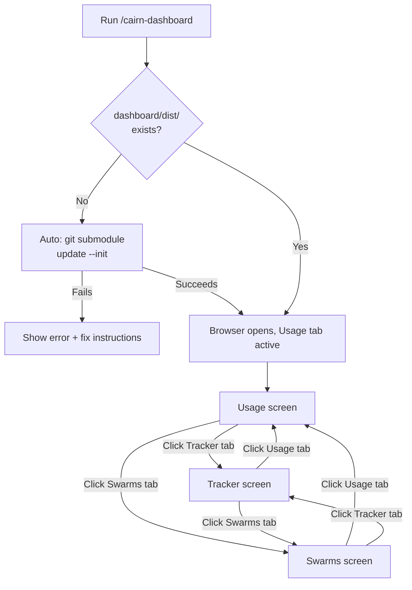
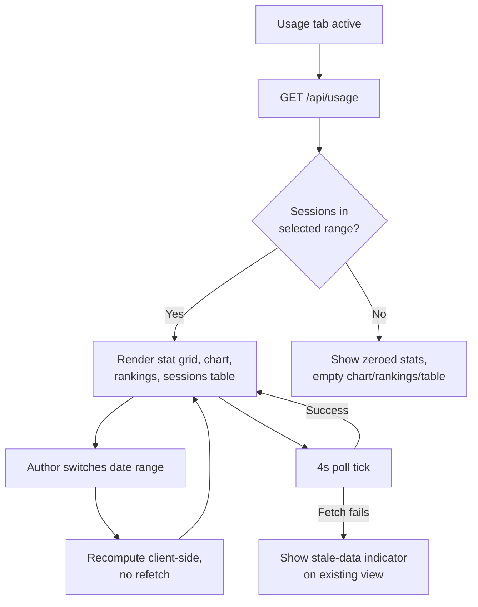
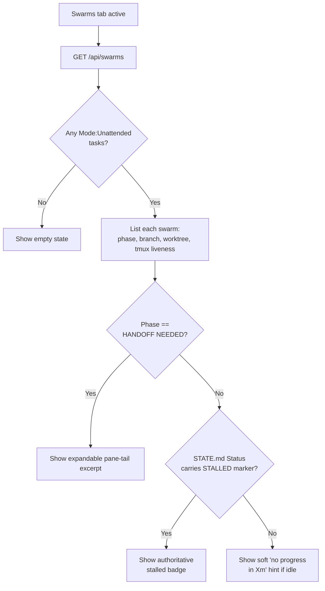

# UX Specification: cairn-dashboard

## Metadata
- UX Specification Version: v0.1
- Last Updated: 2026-08-19
- Derived From: docs/requirements/prd.md, docs/requirements/user-flows.md
- Author:
  - AI Tool: Claude Code
  - LLM Model: claude-sonnet-5
- Reviewed By:

---

## User Personas
| Persona | Description | Primary Goal |
|---------|-------------|--------------|
| Cairn author | Single user, running cairn against their own projects | Quickly check usage/cost, task state, and running swarms without digging through raw files |

---

## User Journey
The cairn author launches the dashboard via `/cairn-dashboard`, lands on the Usage screen, and moves between three always-visible tabs — Usage, Tracker, Swarms — as their attention shifts between "what am I spending," "what's in progress," and "is my background swarm stuck." Each screen polls its own data every 4 seconds; the author never manually refreshes. The whole session is read-only observation — no screen lets the author edit, delete, or trigger anything; the dashboard is a window onto state that other cairn agents/commands change, not a control surface.

---

## Interaction Flows

**Figure 1: Launch and top-level navigation**

**Figure 2: Usage screen data flow**

**Figure 3: Swarms screen decision flow**

---

## Navigation Model
| From Screen | Action | Destination | Condition |
|-------------|--------|-------------|-----------|
| Any screen | Click "Usage" tab | Usage screen | Always available |
| Any screen | Click "Tracker" tab | Tracker screen | Always available |
| Any screen | Click "Swarms" tab | Swarms screen | Always available |
| Tracker screen | Click "Board" sub-tab | Tracker screen, Board view | Always available |
| Tracker screen | Click "Roadmap" sub-tab | Tracker screen, Roadmap view | Always available |
| Usage screen | Click a date-range button | Usage screen, recomputed | Always available |
| Swarms screen | Click a `HANDOFF NEEDED` swarm's pane-tail toggle | Swarms screen, excerpt expanded | Only on swarms whose phase is `HANDOFF NEEDED` |

Direct navigation via URL hash (`#usage`, `#tracker`, `#tracker/road`, `#swarms`) lands on the same screen/sub-view without going through the tab bar — supports refresh and shared links.

---

## Screen Specifications

### Usage
**Purpose:** Let the author see Claude Code token usage and cost at a glance (US-001).
**Accessible Roles:** Cairn author (sole persona) — always accessible, no gating.

**Primary Actions:**
| Action | Available To | System Response |
|--------|-------------|-----------------|
| Select a date range (Today / 7d / 30d / Month / All) | Cairn author | Stats, chart, and rankings recompute client-side against the already-fetched session list — no refetch (FR-007) |
| (passive) Wait for the 4s poll | Cairn author | View updates in place with new usage data, no visible reload |

**Permission Rules:**
| Element / Action | Role | Visibility |
|-----------------|------|------------|
| Entire screen | Cairn author | Always visible |

**States:**
- **Loading:** "Loading…" text shown only on the very first fetch, before any data has ever rendered.
- **Empty:** No sessions in the selected range — stat grid shows zeroed values, chart/rankings/sessions table each show their own empty-state message, never an error.
- **Error:** A poll fails after data has already rendered once — a stale-data indicator appears on the existing (last-good) view; the screen never clears to blank or crashes.
- **Success:** The rendered stat grid/chart/rankings/table *is* the success state — no separate confirmation affordance needed.

---

### Tracker
**Purpose:** Let the author see task-tracker state (Board and Roadmap) without opening `TRACKER.md` directly (US-002).
**Accessible Roles:** Cairn author (sole persona) — always accessible, no gating.

**Primary Actions:**
| Action | Available To | System Response |
|--------|-------------|-----------------|
| Switch between Board and Roadmap sub-tabs | Cairn author | Same already-fetched row data re-rendered grouped by Status (Board) or Milestone (Roadmap) |
| (passive) Wait for the 4s poll | Cairn author | Rows update in place if `TRACKER.md` changed |

**Permission Rules:**
| Element / Action | Role | Visibility |
|-----------------|------|------------|
| Entire screen | Cairn author | Always visible |

**States:**
- **Loading:** "Loading…" text shown only on the very first fetch.
- **Empty:** `TRACKER.md` doesn't exist or has no rows — a single empty-state message replaces both sub-views (Board/Roadmap sub-tabs hide until rows exist).
- **Error:** A poll fails after data has already rendered once — stale-data indicator, same as Usage.
- **Success:** The rendered Board/Roadmap itself is the success state.

---

### Swarms
**Purpose:** Let the author monitor running Unattended coding-chain swarms without manually checking `tmux`/`STATE.md` (US-003).
**Accessible Roles:** Cairn author (sole persona) — always accessible, no gating.

**Primary Actions:**
| Action | Available To | System Response |
|--------|-------------|-----------------|
| Expand a `HANDOFF NEEDED` swarm's pane-tail excerpt | Cairn author | Shows the bounded ~20-line tmux pane tail for that swarm only |
| (passive) Wait for the 4s poll | Cairn author | Swarm list updates in place — phase, liveness, badges recompute from fresh `STATE.md`/`HISTORY.md` reads |

**Permission Rules:**
| Element / Action | Role | Visibility |
|-----------------|------|------------|
| Entire screen | Cairn author | Always visible |
| Pane-tail excerpt | Cairn author | Only for swarms whose `phase == HANDOFF NEEDED` |
| Authoritative stalled badge | Cairn author | Only for swarms whose `STATE.md` `Status` already carries the `STALLED (...)` marker |
| Soft "no progress" hint | Cairn author | Only for swarms that are idle but not `STALLED`, `HANDOFF NEEDED`, or `PUBLISH` |

**States:**
- **Loading:** "Loading…" text shown only on the very first fetch.
- **Empty:** No `Mode: Unattended` tasks exist — "No unattended swarms running." message.
- **Error:** A poll fails after data has already rendered once — stale-data indicator, same as Usage/Tracker.
- **Success:** The rendered swarm list itself is the success state.

---

## Assumptions & Open Questions
**Assumptions:**
- Single persona, no auth, no role gating — every action and screen is visible to whoever opens the dashboard, consistent with Project Definition's local-only scope.
- The dashboard is read-only observation throughout — no screen provides an edit/delete/trigger action on any underlying data (transcripts, `TRACKER.md`, `STATE.md` are never written to by this application).

**Open Questions:**
- None — all 7 discovery dimensions were covered directly from already-approved requirements docs, with no new behavior introduced beyond what `prd.md`/`user-stories.md`/`user-flows.md` already specify.
